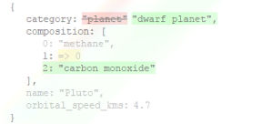

```{r setup, include=FALSE}
knitr::opts_chunk$set(echo = TRUE, screenshot.force = TRUE, fig.path = "img/fig-")
```




# jsondiff

[](https://travis-ci.org/bergant/jsondiff)

## Overview

**jsondiff** finds and renders difference in values between JSONs. Diffing R
objects (like lists and dataframes) is also supported by automatic conversion 
to JSON. It is implemented as an R interface to
[jsondiffpatch](https://github.com/benjamine/jsondiffpatch), powered by
[htmlwidgets](http://www.htmlwidgets.org/) framework.

## Installation 

```{r, eval=FALSE}
devtools::install_github("bergant/jsondiff")
```


## Usage 

Compare two lists:

```{r list, fig.height=1.5}
x <- list(
  name = "Pluto", orbital_speed_kms = 4.7, category = "planet", 
  composition = c("methane", "nitrogen")
)

y <- list(
  name = "Pluto", category = "dwarf planet", orbital_speed_kms = 4.7, 
  composition = c("nitrogen", "methane", "carbon monoxide")
)

library(jsondiff)

jsondiff(x, y)
```

Show also unchanged data:
```{r list_unchanged, fig.height=1.5}
jsondiff(x, y, hide_unchanged = FALSE)
```


Character vectors of size 1 are evaluated as JSONs:

```{r json, fig.height=1.5}
library(jsonlite)
json_x <- toJSON(x) 
json_y <- toJSON(y) 

jsondiff(json_x, json_y)
```

Data frames (example is from
[daff](https://github.com/edwindj/daff) package, which is probably a better 
choice to handle difference between data frames than **jsondiff**):

```{r dataframe, fig.height=3}
x <- y <- iris[1:3,]

x <- head(x,2) # remove a row
x[1,1] <- 10 # change a value
x$hello <- "world"  # add a column
x$Species <- NULL # remove a column


jsondiff(y, x)
```

Note that there are several options when converting R objects to JSON. Instead
of using `toJSON` explicitly, one can use `json_options`. For example, 
converting from data frame to JSON as "column first":

```{r dataframe_cols, fig.height=3}
jsondiff(y, x, json_opt = json_options(dataframe = "columns", factor = "string"))
```


## Related projects

Made possible by:

- [jsondiffpatch](https://github.com/benjamine/jsondiffpatch) - Diffing and patching JSONs (JavaScript library)
- [htmlwidgets](https://github.com/ramnathv/htmlwidgets) - Framework for easily creating R bindings to JavaScript libraries
- [jsonlite](https://github.com/jeroen/jsonlite) - A Robust, High Performance JSON Parser and Generator for R 

See also:

- [Daff](https://github.com/edwindj/daff) - Diff, patch and merge for data.frames
- [listviewer](https://github.com/timelyportfolio/listviewer) - R htmlwidget to view lists
- [diffobj](https://github.com/brodieG/diffobj) - Compare R Objects with a Diff
- [tools::Rdiff](https://stat.ethz.ch/R-manual/R-devel/library/tools/html/Rdiff.html): Difference R Output Files


## License

MIT

